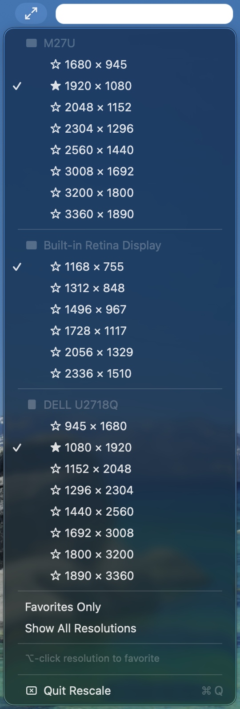

# Rescale

**The missing menu for display scaling.**

Quick-switch your Mac's display scaling from the menu bar — the same
"Larger Text ↔ More Space" options buried in System Settings, now two clicks away.



## Install

1. Download **Rescale.zip** from the [latest release](../../releases/latest)
2. Unzip and move **Rescale.app** wherever you like (e.g. Applications)
3. Open Terminal and run: `xattr -cr /path/to/Rescale.app`
4. Double-click to launch

Step 3 removes the macOS quarantine flag on unsigned apps. This only needs to
be done once.

## Features

- Lists every connected display with its available scaled resolutions
- Switches resolution instantly — no trip to System Settings
- Orientation icons show landscape vs portrait displays
- Option-click any resolution to favorite it; toggle "Favorites Only" to filter
- "Show All Resolutions" reveals every HiDPI mode the display supports
- Lightweight menu bar agent — no Dock icon, no windows

## How it works

Rescale uses CoreGraphics to enumerate connected displays and their HiDPI scaled
modes. It filters to a useful subset: modes matching the display's native aspect
ratio, from half-native resolution (2× retina, "Larger Text") up to 1:1 native
("More Space").

See [docs/adr/](docs/adr/) for design decisions and the reasoning behind the
filtering approach.

## Build from source

Requires macOS 13+ and Swift 5.9+ (included with Xcode 15+).

```bash
swift run                 # build and run (debug)
./Scripts/make-app.sh     # build a .app bundle
```

## License

MIT
